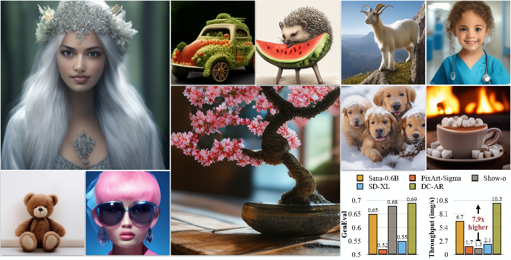

# DC-AR: Efficient Masked Autoregressive Image Generation with Deep Compression Hybrid Tokenizer

\[[Paper](https://arxiv.org/abs/2507.04947)\] \[[Demo](https://dc-ar.hanlab.ai)\] \[[Project](https://hanlab.mit.edu/projects/dc-ar)\]



## News

- \[2025/6\] 🔥 DC-AR is accepted by ICCV 2025!

## Abstract

We introduce DC-AR, a novel masked autoregressive (AR) text-to-image generation framework that delivers superior image generation quality with exceptional computational efficiency. Due to the tokenizers' limitations, prior masked AR models have lagged behind diffusion models in terms of quality or efficiency. We overcome this limitation by introducing DC-HT - a deep compression hybrid tokenizer for AR models that achieves a 32× spatial compression ratio while maintaining high reconstruction fidelity and cross-resolution generalization ability. Building upon DC-HT, we extend MaskGIT and create a new hybrid masked autoregressive image generation framework that first produces the structural elements through discrete tokens and then applies refinements via residual tokens. DC-AR achieves state-of-the-art results with a gFID of **5.49** on MJHQ-30K and an overall score of **0.69** on GenEval, while offering **1.5-7.9×** higher throughput and **2.0-3.5×** lower latency compared to prior leading diffusion and autoregressive models.

## Setup

Download the repo and install the environment:

```bash
git clone https://github.com/mit-han-lab/dc-ar
cd dc-ar
conda create -n dcar python=3.10
conda activate dcar
pip install -e .
```

Download DC-HT and DC-AR

```bash
git clone https://huggingface.co/mit-han-lab/dc-ar-512
git clone https://huggingface.co/mit-han-lab/dc-ht
```

Download the safety check model:

```bash
git clone https://huggingface.co/google/shieldgemma-2b
```

Note: We use ShieldGemma-2B from Google DeepMind to filter out unsafe prompts in our demo. We strongly recommend using it if you are distributing our demo publicly.

## Usage

### Gradio demo

You may launch the Gradio demo using the following script:

```bash
python app.py --shield_model_path /path/to/ShieldGemma2B 
```

### Command Line Inference

1. Sampling with single prompt:

```bash
python sample.py --prompt "YOUR_PROMPT" \
   --sample_folder_dir /path/to/save_dir \
   --shield_model_path /path/to/ShieldGemma2B
```

2. Sampling with multiple prompts:

```bash
# You can add --store_seperately to store each image individually, otherwise images will be stored in one grid.
python sample.py --prompt_list [Prompt1, Prompt2, ..., PromptN] \
   --sample_folder_dir /path/to/save_dir \
   --shield_model_path /path/to/ShieldGemma2B
```

## Acknowledgements

Our codebase is inspired by awesome open source research projects such as [1D-Tokenizer](https://github.com/bytedance/1d-tokenizer) and [MAR](https://github.com/LTH14/mar). Thanks for their efforts!

## License
+ [Code](./LICENSE/code)
+ [DC-AR Models](./LICENSE/dc_ar_models)

## Contact
+ [Han Cai](http://hancai.ai/)
+ [Song Han](https://hanlab.mit.edu/songhan)

## 📖 BibTeX

```bibtex
@article{wu2025dcar,
  title={DC-AR: Efficient Masked Autoregressive Image Generation with Deep Compression Hybrid Tokenizer},
  author={Wu, Yecheng and Chen, Junyu and Zhang, Zhuoyang and Xie, Enze and Yu, Jincheng and Chen, Junsong and Hu, Jinyi and Lu, Yao and Han, Song and Cai, Han},
  journal={arXiv preprint arXiv:2410.10733},
  year={2025}
}
```
